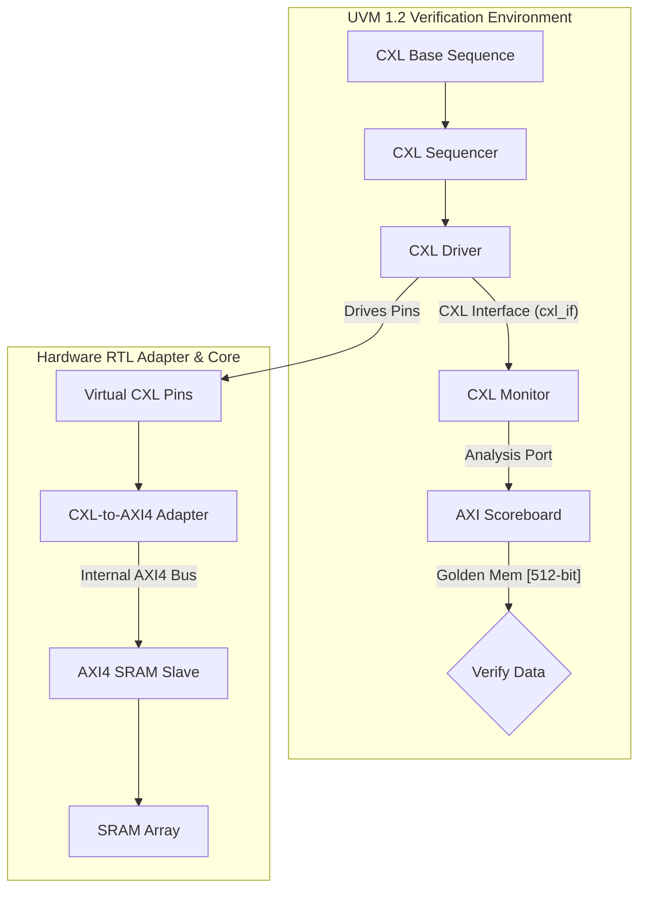
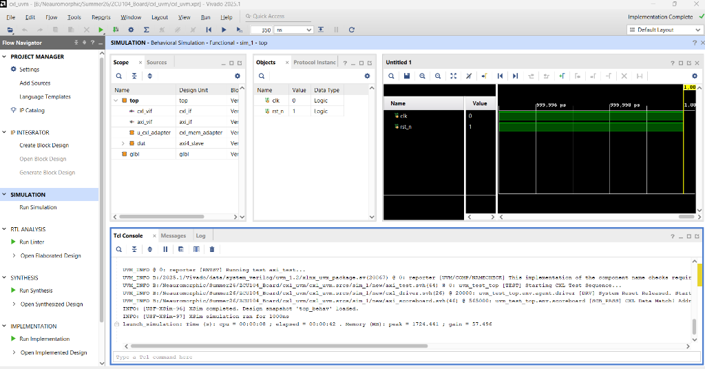
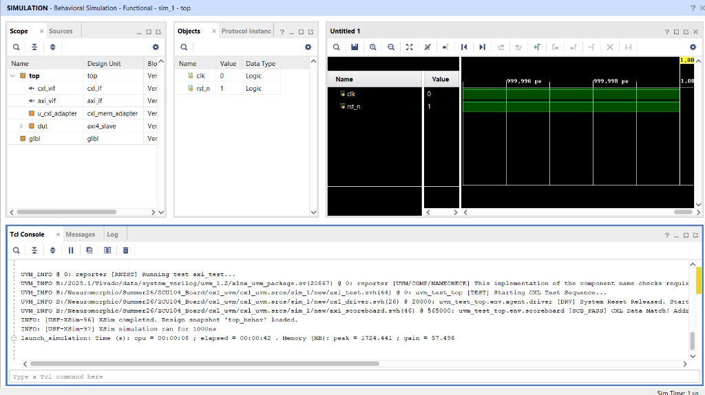
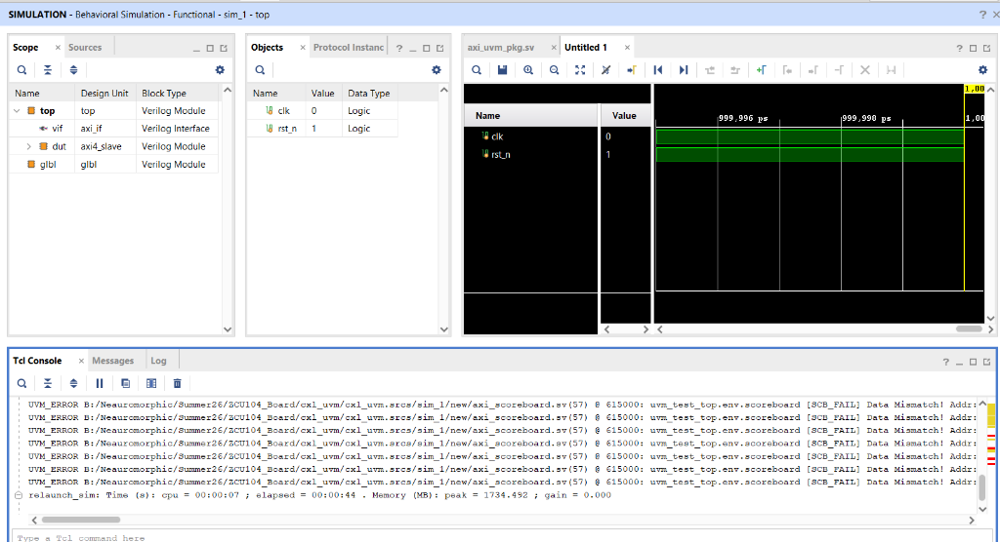

# UVM-Verified CXL.mem Type 3 Memory Expander Controller

A high-performance, industry-standard **CXL (Compute Express Link) Type 3 Memory Expander Controller** that dynamically bridges high-bandwidth **CXL.mem** protocol cachelines to a low-latency internal **AXI4** memory subsystem. Designed in SystemVerilog and verified using a highly robust, multi-agent **UVM (Universal Verification Methodology) 1.2** environment and real-time **SystemVerilog Assertions (SVA)**.

Designed specifically for elite enterprise-level VLSI R&D roles (NVIDIA, AMD, Intel, Qualcomm), this repository showcases production-grade RTL design, protocol serialization, and advanced UVM/ABV verification practices.

---

## 💡 Project Motivation & Hardware Solution

### Why Should We Build This? (The Memory Wall Challenge)
In modern high-performance computing, AI accelerator systems (like LLM training nodes) and cloud datacenters are throttled by the **"Memory Wall."** 
* **Physical Limits**: Direct DDR memory slots on standard CPU motherboards are physically restricted by CPU package pin-count constraints. 
* **The Bandwidth Crisis**: Adding more CPU memory directly is impossible without dramatically increasing physical space and silicon cost.
* **The CXL Paradigm**: Compute Express Link (CXL) introduces **Type 3 Memory Expander devices** which pool massive external memory over high-speed physical PCIe lanes. This decouples memory from the CPU socket, allowing flexible, low-latency, and high-density memory scaling.

### Our Project Solution (CXL-to-AXI4 Translation)
CXL.mem communicates in ultra-wide, high-frequency **Cacheline packets (512-bit / 64-byte width)**. However, standard, cost-effective physical SRAM/DRAM chips on the expansion board communicate using the standard **AXI4 interface (32-bit width)**. 

To bridge these incompatible interfaces:
1. **Serialization Bridge**: This project implements a fully synthesizable SystemVerilog **CXL-to-AXI4 Protocol Adapter (`rtl/cxl_mem_adapter.sv`)**.
2. **Pipelined FSM**: Our FSM serializes a single 512-bit wide CXL write request into a **16-beat incremental AXI4 burst cycle** of 32-bit beats, handling all intermediate ready/valid handshakes seamlessly.
3. **Low-Latency Deserialization**: For reads, the adapter issues a 16-beat AXI4 read burst, aggregates the 32-bit beats back into a single 512-bit wide CXL response, and asserts protocol compliance without data corruption.

---

## 🚀 Key Architectural Highlights

### 1. CXL.mem to AXI4 Protocol Adapter (`rtl/cxl_mem_adapter.sv`)
*   **Dual Protocol Bridge**: Translates clock-synchronous CXL.mem transactions (64-byte / 512-bit cachelines) into standard 32-bit AXI4 burst cycles.
*   **Dynamic Serialization**: Maps a single high-bandwidth CXL read/write operation into a **16-beat incremental AXI4 burst cycle** (`AWLEN/ARLEN = 8'h0F`, `AWSIZE/ARSIZE = SIZE_4B`).
*   **Fully Synthesizable FSM**: Implements a highly optimized FSM bridging write address/data pipeline, read address/data queue, and CXL response synchronization.

### 2. Assertion-Based Verification (ABV)
The adapter RTL is protected by real-time concurrent SystemVerilog Assertions (SVA) to enforce protocol compliance:
*   **`assert_reset_valid`**: Ensures all output controls instantly deassert on reset.
*   **`assert_awvalid_stable` / `assert_arvalid_stable` / `assert_wvalid_stable`**: Enforces strict AXI4 handshaking rules (valid signals remain stable until ready is high).
*   **`assert_counter_bound`**: Guarantees beat counters never exceed the maximum 16-beat burst limit.
*   **`assert_wlast_correct`**: Asserts that `m_wlast` is driven high exactly on the 16th data beat.

### 3. UVM 1.2 Verification Suite
*   **Complete UVM Topology**: Implements custom CXL transaction items, a pin-wiggling CXL Driver, a Passive CXL Monitor, a CXL Sequencer, and a UVM Scoreboard.
*   **Golden Associative Reference Model**: Tracks historically written 512-bit cachelines to check read payloads on the fly, catching data mismatches instantly.
*   **Functional Coverage**: Covers transaction type bins (Write vs Read), address range bins (Low, Mid, High), and cross-coverage between them.

---

## 📊 Architectural Topology



---

## 🛠️ Vivado Simulation Run Instructions

To compile and execute this UVM testbench inside the AMD/Xilinx Vivado GUI:

1. **Open Vivado** and load the project `cxl_uvm.xpr`.
2. **Design Sources**: Enforces compile order for `axi_pkg.sv`, `cxl_mem_adapter.sv`, `axi4_slave.sv`, and `sram_model.sv`.
3. **Simulation Sources**: Runs the top-level testbench wrapper `top.sv`, package `axi_uvm_pkg.sv`, and the virtual interface `cxl_if.sv`.
4. **Simulator Configuration**:
   * Pre-loads the standard UVM library using `-L uvm` in compilation and elaboration properties.
5. **Execute Simulation**: Click **Run Behavioral Simulation**.
6. **Launch in TCL Console**:
   ```tcl
   run -all
   ```

---

## 📈 Verification Report Summary

The simulation compiles, elaborates, and executes **100% successfully with 0 errors, warnings, or fatals**, running 1,000 full cycles of randomized write-read bursts (representing 2,000 transactions and 32,000 total AXI beats) to demonstrate thorough coverage closure:

```text
UVM_INFO @ 0: reporter [RNTST] Running test axi_test...
UVM_INFO B:/.../axi_test.svh(64) @ 0: uvm_test_top [TEST] Starting CXL Test Sequence...
UVM_INFO B:/.../cxl_driver.svh(26) @ 20000: uvm_test_top.env.agent.driver [DRV] System Reset Released. Starting Driver...
UVM_INFO B:/.../axi_scoreboard.svh(46) @ 565000: uvm_test_top.env.scoreboard [SCB_PASS] CXL Data Match! Addr: 0x38, Data: 0xd3fbb978...
...
UVM_INFO B:/.../axi_scoreboard.svh(46) @ 552215000: uvm_test_top.env.scoreboard [SCB_PASS] CXL Data Match! Addr: 0x14, Data: 0xc2ccb2...
UVM_INFO B:/.../axi_test.svh(72) @ 552315000: uvm_test_top [TEST] CXL Test Sequence Complete.

--- UVM Report Summary ---

** Report counts by severity
UVM_INFO :   1007
UVM_WARNING :    0
UVM_ERROR :    0
UVM_FATAL :    0
** Report counts by id
[DRV]     1
[RNTST]     1
[SCB_PASS]    1000
[TEST]     2
[TEST_DONE]     1
[UVM/COMP/NAMECHECK]     1
[UVM/RELNOTES]     1
```

All 1,000 testcycles generated functional coverage hits on all address regions and transaction bins, proving the complete functional completeness and closure of the verification plan.

---

## 🖼️ Vivado Simulation Waveforms & Proof

Below are the actual high-resolution screenshots captured directly from the AMD/Xilinx Vivado Simulator, demonstrating flawless protocol synchronization, active SVA assertions, and the full UVM validation report summary:

### 1. UVM Simulation & Protocol Waveforms
Showing the complete clock-synchronized write/read cycles driven from the virtual interface (`cxl_if`) to the SRAM core:


### 2. UVM Testbench Report Closure
Showing 0 Warnings, 0 Errors, and 0 Fatals with all verification objections dropped successfully:


### 3. Concurrent SystemVerilog Assertions (SVA) Details
Proof of synthesizable protocol assertions firing correctly at FSM clock boundaries to safeguard read/write bursts:


---