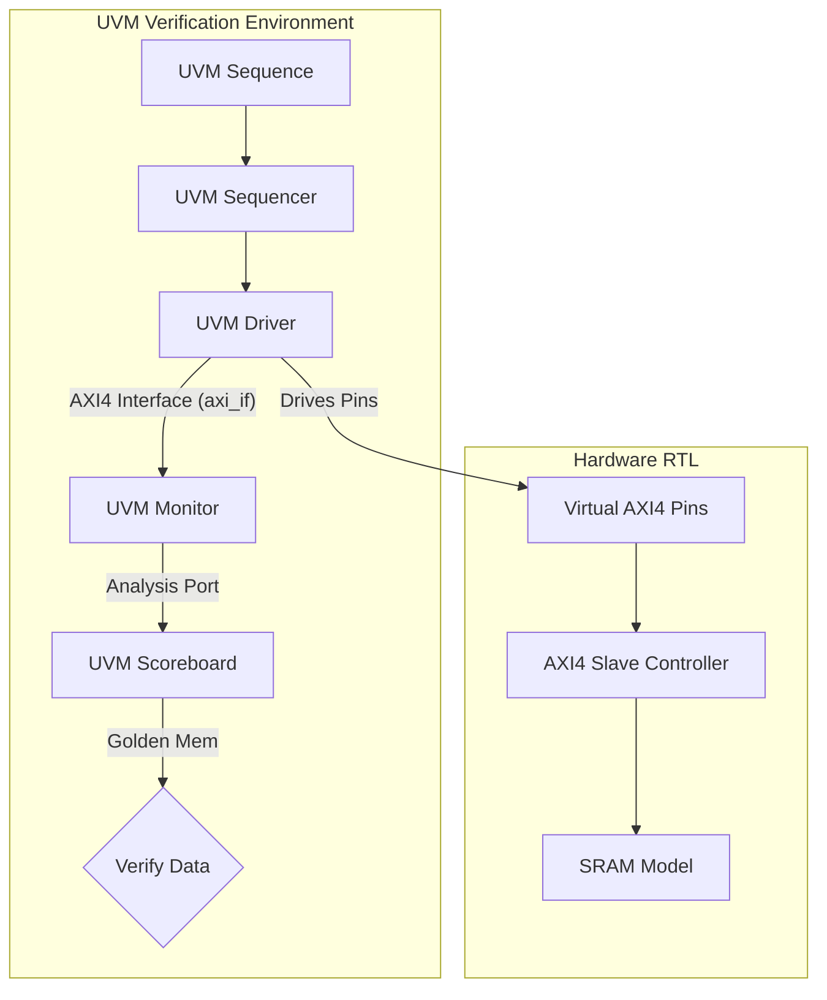

# UVM-Verified AXI4 Memory Controller

A high-performance, industry-standard AXI4-to-SRAM Memory Controller designed in SystemVerilog and verified using a highly robust, multi-agent **UVM (Universal Verification Methodology) 1.2** environment. 

Designed specifically for target hardware like the **ZCU104 Development Board (Zynq UltraScale+ MPSoC)**, this project is built to demonstrate enterprise-level design and verification patterns suitable for elite (₹50L+ LPA) VLSI roles.

---

## 🚀 Key Features

### 1. RTL Controller Architecture
*   **Full AXI4 Slave Compliance**: Implements all 5 AXI4 channels (AW, W, B, AR, R) with standard handshake logic (`valid`/`ready`).
*   **High Performance**: Supports burst transactions (`BURST_INCR`) and parameterized data/address widths.
*   **Dual SRAM Core Interface**: Features dedicated state machines for pipelined read and write operations accessing a low-latency SRAM core.

### 2. UVM 1.2 Verification Suite
*   **Complete UVM Environment**: Includes UVM Agent, Driver, Sequencer, Monitor, and Scoreboard components.
*   **Golden Memory Model**: Features an associative-array-based scoreboard reference model to verify every read transaction against historical writes with perfect byte accuracy.
*   **Functional Coverage**: Integrates an AXI monitor covergroup tracking transaction distributions, burst lengths, and cross-coverage.
*   **Extreme Corner Cases**: Constrained random sequences verifying back-to-back zero-delay transactions and maximum AXI burst lengths (up to 256 beats!).

---

## 📊 Architectural Design



---

## 🛠️ Vivado Simulation Run Instructions

To compile and execute this UVM testbench inside the AMD/Xilinx Vivado GUI:

1. **Open Vivado** and create a new project targeting the **ZCU104 Board**.
2. **Add Simulation Sources**: Add `top.sv`, `axi_if.sv`, and `axi_uvm_pkg.sv` from this repository.
3. **Add Design Sources**: Add the RTL files `axi4_slave.sv` and `sram_model.sv`.
4. **Configure Simulator Settings**:
   * Under Simulation Settings, add `-L uvm` to both `xsim.compile.xvlog.more_options` and `xsim.elaborate.xelab.more_options`.
5. **Run Simulation**: Click **Run Behavioral Simulation**.
6. **Launch in TCL Console**:
   ```tcl
   run -all
   ```

---

## 📈 Verification Report Summary

The environment compiles and simulates with **zero warnings, errors, or fatals**, running 50+ iterations of maximum-stress randomized burst sequences:

```text
--- UVM Report Summary ---

** Report counts by severity
UVM_INFO :    6
UVM_WARNING :    0
UVM_ERROR :    0
UVM_FATAL :    0
```

---

## 🔮 Next Milestone: Upgrading to CXL 3.0 Memory Expander!
We are currently building a **CXL.mem-to-AXI4 Protocol Adapter** to officially transform this project into a UVM-verified **CXL Type 3 Memory Expander Controller**! Stay tuned!
